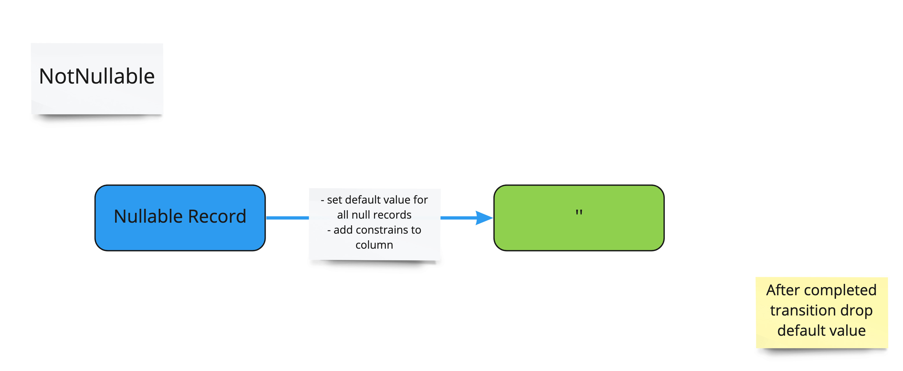

# Nullable to NotNullable Column



Basic migration to remove NullAble require transition period with default value, after transition is finished we just drop the default value constraint.

Start of Transition Period → add default value and NotNull:

```xml
<changeSet author="liquibase" id="14">
    <addDefaultValue columnName="Last_Name"
        defaultValue="example_default"
        schemaName="public"
        tableName="Customers"/>
    <addNotNullConstraint columnName="Last_Name"
        constraintName="last_name"
        schemaName="public"
        tableName="Customers"
        validate="true"/>        
    <addDefaultValue columnName="First_Name"
        defaultValue="example_default"
        schemaName="public"
        tableName="Customers"/>
    <addNotNullConstraint columnName="First_Name"
        constraintName="first_name"
        schemaName="public"
        tableName="Customers"
        validate="true"/>  
</changeSet>

<changeSet author="liquibase" id="15">
    <tagDatabase tag="nullable_to_notnullable_First_Last_Name_transition_start"/>
</changeSet>
```

End of Transition period → required to implement *rollback* tag with adding default value due to not provided automatic functionality by Liquibase

```xml
<changeSet author="liquibase" id="16">
    <dropDefaultValue columnName="Last_Name"
        schemaName="public"
        tableName="Customers"/>
    <dropDefaultValue columnName="First_Name"
        schemaName="public"
        tableName="Customers"/>
    <rollback>
        <addDefaultValue columnName="Last_Name"
            defaultValue="example_default"
            schemaName="public"
            tableName="Customers"/>
        <addDefaultValue columnName="First_Name"
            defaultValue="example_default"
            schemaName="public"
            tableName="Customers"/>
    </rollback>    
</changeSet>

<changeSet author="liquibase" id="17">
    <tagDatabase tag="nullable_to_notnullable_First_Last_Name_transition_end"/>
</changeSet>
```